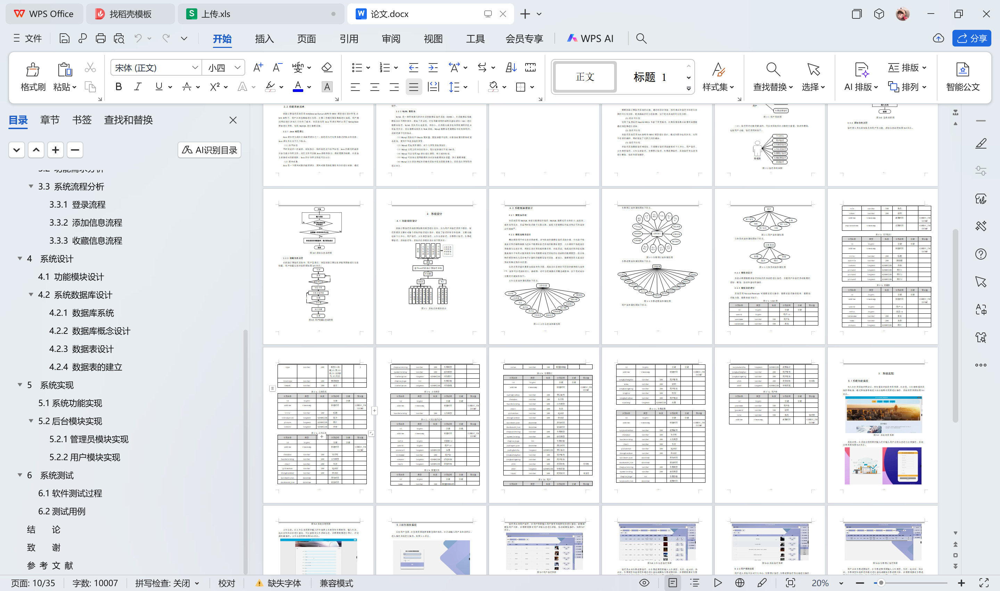

# springboot212-基于SpringBoot的铁路订票管理系统

>  博主介绍：
>  Hey，我是程序员Chaers，一个专注于计算机领域的程序员
>  十年大厂程序员全栈开发‍ 日常分享项目经验 解决技术难题与技术推荐 承接各类网站设计，小程序开发，毕设等。
>  【计算机专业课程设计，毕业设计项目，Java，微信小程序，安卓APP都可以做，不仅仅是计算机专业，其它专业都可以】

## 3000套系统可挑选，获取链接：https://chaerspol.github.io/

<b>QQ【获取完整源码】：674456564</b>

<b>QQ群【获取完整源码】：1058861570</b>

### 系统架构

> 前端：html | js | css | jquery | vue
>
> 后端：springboot | mybatis
> 
> 环境：jdk1.8+ | mysql | maven

# 一、内容包括
包括有  项目源码+项目论文+数据库源码+答辩ppt+远程调试成功

# 二、运行环境

> jdk版本：1.8 及以上； ide工具：IDEA； 数据库: mysql5.7及以上；编程语言: Java

# 三、需求分析

**3.1 可行性分析**

根据铁路订票管理系统的功能，通过对经济效益、技术难点和管理方法进行全面的可行性分析，提供准确的可行性依据。以下是本系统的可行性分析:

(1)经济可行性

使用了免费版的IntelliJ IDEA节省了开发成本，在购买服务器后部署项目便能通过浏览器进行访问。

(2)技术可行性

本管理系统采用B/S架构和MVC模型进行设计，通过分层分包的方法，有利于日常的维护，同时降低了代码之间的耦合。

(3)管理可行性

本管理系统要求管理难度低，只需要有管理员就能够对个人中心、用户管理、火车类型管理、火车信息管理、车票预订管理、车票退票管理、系统管理等信息等进行删除、修改和添加操作。

**3.2 功能需求分析** 

铁路订票管理系统综合网络空间开发设计要求。目的是将铁路订票通过网络平台将传统管理方式转换为在线上管理，完成铁路订票的方便快捷、安全性高、交易规范做了保障，目标明确。铁路订票管理系统可以将功能划分为用户的使用功能和管理员功能。

# 四、功能模块

铁路订票管理系统按照权限的类型进行划分，分为用户和管理员两个模块。管理员模块主要针对整个系统的管理进行设计，提高了管理的效率和标准。主要功能包括个人中心、用户管理、火车类型管理、火车信息管理、车票预订管理、车票退票管理、系统管理等；系统的总体模块设计如下图所示。

# 五、效果图展示【部分效果图】

图5-1 系统首页界面【当人们打开系统的网址后，首先看到的就是首页界面。在这里，人们能够看到系统的导航条，通过导航条导航进入各功能展示页面进行操作。系统首页界面如图5-1所示】

图5-2系统注册页面【系统注册：在系统注册页面的输入栏中输入用户注册信息进行注册操作，系统注册页面如图5-2所示】

图5-3火车信息详细页面【火车信息：在火车信息页面的输入栏中选择火车类型和车票类型，输入车次、起点站和终点站进行查询，可以查看到火车详细信息，并根据需要进行预订、评论或收藏操作；火车信息页面如图5-3所示】

图5-4个人中心界面【个人中心：在个人中心页面通过填写个人详细信息进行更新信息操作；还可以对我的收藏进行详细操作；如图5-4所示】

图5-5 后台登录界面【后台用户登录，在登录页面选择需要登录的角色，在正确输入用户名和密码后，进入操作系统进行操作；如图5-5所示】

图5-6 管理员主界面【管理员进入主页面，主要功能包括对个人中心、用户管理、火车类型管理、火车信息管理、车票预订管理、车票退票管理、系统管理等进行操作。管理员主页面如图5-6所示】

图5-7用户管理界面【管理员点击用户管理。在用户页面输入用户账号和选择性别进行查询、新增或删除用户列表，并根据需要对用户详情信息进行详情、修改或删除操作；如图5-7所示：】

 <b>完整文章</b>
 
 

## 3000套系统可挑选，获取链接：https://chaerspol.github.io/

<b>QQ【获取完整源码】：674456564</b>

<b>QQ群【获取完整源码】：1058861570</b>

